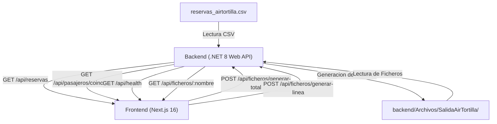

<div align="center">

# AIRTORTILLA - FLIGHT OPS CONTROL

**Sistema Integral de Procesamiento de Reservas Aereas, Deteccion de Pasajeros Coincidentes y Particion de Archivos CSV**

[](https://dotnet.microsoft.com/)
[](https://nextjs.org/)
[](https://react.dev/)
[](https://tailwindcss.com/)
[](http://localhost:5000/swagger)

<p align="center">
  <a href="#caracteristicas-principales">Caracteristicas</a> •
  <a href="#arquitectura-del-sistema">Arquitectura</a> •
  <a href="#endpoints-del-backend">API Endpoints</a> •
  <a href="#instalacion-y-despliegue">Instalacion</a> •
  <a href="#modalidades-de-particion">Modalidades C#</a> •
  <a href="#estructura-del-proyecto">Estructura</a>
</p>

</div>

---

## Descripcion General

AirTortilla es una plataforma integral desarrollada para resolver el procesamiento de volumenes de reservas de vuelo. Combina un motor de alto rendimiento en C# (.NET 8 ASP.NET Core Minimal APIs) con un panel de control interactivo en Next.js y React disenado con una interfaz modular de operaciones.

El sistema resuelve la lectura, validacion y particion automatizada de billetes internacionales, agrupando reservas por destino y fecha mientras aplica reglas de negocio como la asignacion de localizadores de grupo compartidos a pasajeros con reservas multiples.

---

## Caracteristicas Principales

### 1. Particion Automatizada por Pais y Fecha
- Divide el fichero maestro de reservas en archivos individuales siguiendo el patron:
  ```text
  AirTortilla_XX_AAAA_MM_DD.csv  (Ej: AirTortilla_FR_2024_10_15.csv)
  ```
- Generacion de cabecera estandar y delimitacion estricta por punto y coma (`;`).

### 2. Deteccion de Pasajeros Coincidentes
- Agrupa reservas con identico Nombre, Origen y Destino.
- Asigna un Localizador Comun de Grupo (ej. `LOC-FR-5X01`) compartiendo el trayecto, manteniendo un Ticket ID univoco por cada billete individual.
- Deteccion de grupos de 5 o mas reservas repetidas.

### 3. Doble Estrategia de Persistencia en Disco
- **Modalidad TOTAL:** Agrupacion en memoria RAM mediante `Dictionary<string, List<string>>` y escritura en bloque con `File.WriteAllLines`.
- **Modalidad LINEA A LINEA:** Lectura y escritura en flujo continuo (*streaming*) con `StreamWriter(..., append: true)` y memoria constante O(1).

### 4. Panel de Control Web (Frontend)
- **Vista de Reservas:** Filtros instantaneos por pais de destino, buscador en tiempo real y metricas operativas.
- **Vista de Casos Coincidentes:** Tarjetas de expediente con monogramas de pasajero, rutas y accion de copia rapida de localizador.
- **Consola de Ejecucion:** Terminal interactiva que muestra los registros de ejecucion del backend en tiempo real.
- **Visor CSV:** Alterna entre tabla relacional formateada y texto en bruto con opcion de copia y descarga directa del archivo.
- **Resiliencia de Conexion:** Heartbeat activo que retiene los ultimos datos validos en caso de caida del servidor, informando de la desactualizacion sin generar datos simulados.

---

## Arquitectura del Sistema



---

## Endpoints del Backend

El backend expone una API REST documentada interactivamente mediante Swagger UI:

| Metodo | Endpoint | Etiqueta | Descripcion |
| :---: | :--- | :---: | :--- |
| `GET` | `/api/health` | `Health` | Heartbeat de comprobacion de estado del servidor |
| `GET` | `/api/reservas` | `Reservas` | Devuelve el catalogo de las reservas parseadas |
| `GET` | `/api/pasajeros/coincidentes` | `Pasajeros` | Agrupa y devuelve los casos de reservas coincidentes |
| `POST` | `/api/ficheros/generar-total` | `Ficheros` | Ejecuta la generacion en bloque en memoria (File.WriteAllLines) |
| `POST` | `/api/ficheros/generar-linea` | `Ficheros` | Ejecuta la generacion en flujo continuo (StreamWriter append) |
| `GET` | `/api/ficheros` | `Ficheros` | Lista los archivos .csv generados en la carpeta de salida |
| `GET` | `/api/ficheros/{nombreFichero}` | `Ficheros` | Lee y devuelve las lineas de un archivo CSV especifico |

Documentacion interactiva disponible en: `http://localhost:5000/swagger`

---

## Modalidades de Particion: Comparativa Tecnica

| Caracteristica | Modalidad TOTAL | Modalidad LINEA A LINEA |
| :--- | :--- | :--- |
| **API C# Utilizada** | `File.WriteAllLines()` | `StreamReader` / `StreamWriter(..., append: true)` |
| **Consumo de Memoria** | Temporal O(N) (Carga en RAM) | Constante O(1) (Independiente del tamaño) |
| **Escritura en Disco** | Atomica en bloque | Concurrente registro a registro |
| **Caso de Uso Optimo** | Archivos pequenos y medianos | Archivos masivos / Big Data |
| **Velocidad de E/S** | Maxima para lotes acotados | Continua y sin saturacion de memoria |

---

## Instalacion y Despliegue

### Requisitos Previos
- .NET 8.0 SDK
- Node.js 18+ y npm

### 1. Clonar el repositorio
```bash
git clone https://github.com/svanrell/AirTortilla.git
cd AirTortilla
```

### 2. Iniciar el Backend (.NET 8 Web API)
```bash
dotnet run --project backend/EjercicioFicheros.csproj
```
El servidor estara disponible en:
- API URL: `http://localhost:5000`
- Swagger UI: `http://localhost:5000/swagger`

### 3. Iniciar el Frontend (Next.js 16)
En una nueva terminal:
```bash
cd frontend
npm install
npm run dev
```
La aplicacion web estara disponible en:
- Dashboard Web: `http://localhost:3000`

---

## Estructura del Proyecto

```text
AirTortilla/
├── backend/                               # Proyecto ASP.NET Core 8 Web API
│   ├── EjercicioFicheros.csproj           # Configuracion del proyecto y paquetes NuGet
│   ├── Program.cs                         # Endpoints Minimal API, CORS y Swagger
│   ├── ManejarCSV.cs                      # Logica de particion TOTAL y LINEA A LINEA
│   ├── ManejarArchivos.cs                 # Resolucion dinamica de rutas del sistema
│   ├── FormatearCSV.cs                    # Normalizacion y serializacion CSV
│   ├── Reserva.cs                         # Modelo de datos de Reserva
│   ├── Persona.cs                         # Modelo de datos de Pasajero
│   └── Archivos/                          # Almacenamiento local (CSVs excluidos en Git)
│       └── SalidaAirTortilla/             # Directorio de salida de los CSVs generados
│
├── frontend/                              # Dashboard Next.js con Tailwind CSS
│   ├── src/
│   │   ├── app/
│   │   │   ├── layout.tsx                 # Layout principal
│   │   │   ├── page.tsx                   # Ensamblador de vistas y sincronizacion API
│   │   │   └── globals.css                # Tokens de diseno y estilos
│   │   ├── components/
│   │   │   ├── Header.tsx                 # Barra superior de navegacion y estado API
│   │   │   └── views/
│   │   │       ├── ViewReservas.tsx        # Tabla de vuelos con buscador y filtros
│   │   │       ├── ViewCoincidentes.tsx    # Tarjetas de casos con localizador comun
│   │   │       ├── ViewGenerarFicheros.tsx # Consola terminal y disparadores C#
│   │   │       └── ViewVisorCSV.tsx        # Inspector y parseador interactivo de CSV
│   │   ├── lib/
│   │   │   └── api.ts                     # Cliente HTTP con cache y resiliencia Stale
│   │   └── types/
│   │       └── index.ts                   # Interfaces TypeScript sincronizadas con C#
│   └── package.json
│
├── .gitignore                             # Exclusion estricta de CSVs y compilados
├── EntregaFicheros.sln                    # Solucion .NET
└── README.md                              # Documentacion del proyecto
```

---

## Exclusion de Datos Sensibles (.gitignore)
Por politica del proyecto, ningun archivo de datos .csv se incluye en el repositorio de control de versiones:
```gitignore
*.csv
**/*.csv
backend/Archivos/*.csv
backend/Archivos/SalidaAirTortilla/
```

---

<div align="center">

AirTortilla Flight Operations System.

</div>
